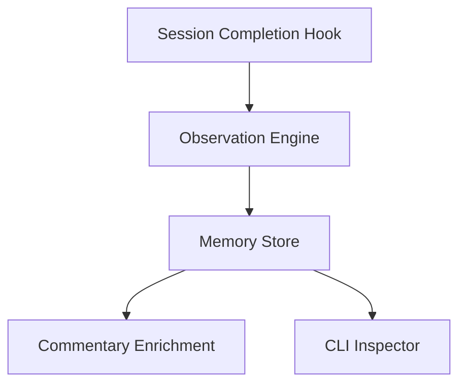
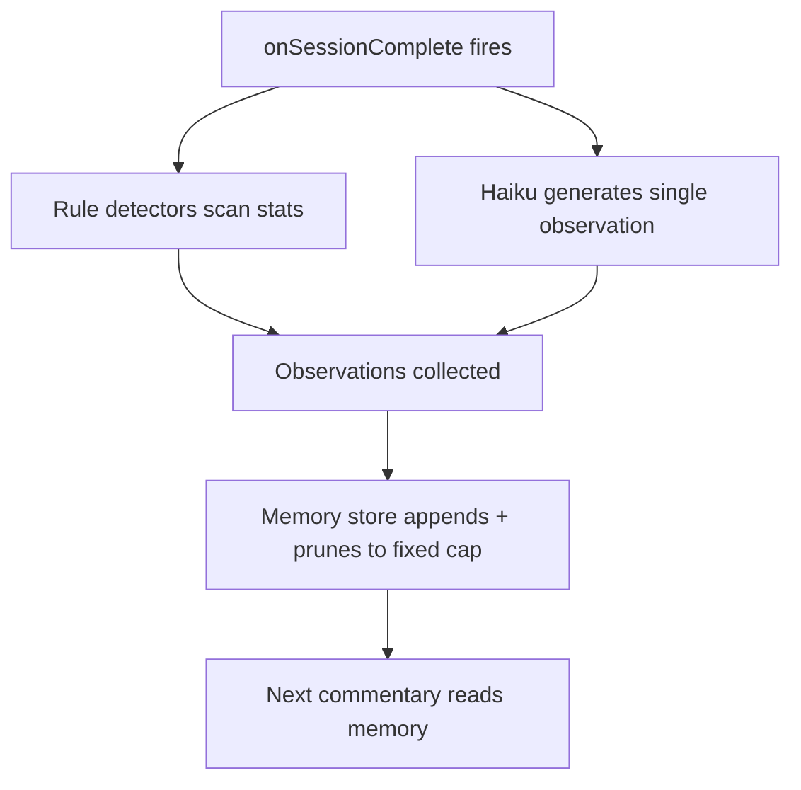

:::quote{author="user"}
Design a companion memory system for the sisyphus companion. The companion should accumulate qualitative observations about the user over time — session sentiments, repo impressions, user patterns, notable moments — and feed them into commentary generation. The user wants both rule-based pattern detection AND Haiku-generated qualitative observations. The memory should be inspectable by the user via CLI.
:::

:::panel{title="Mental model" color="blue"}
The companion currently has quantitative memory — XP, stats, repo visit counts, mood signals — but no qualitative memory. This system adds a persistent observation store where the companion accumulates textual observations about the user across four categories: session sentiments, repo impressions, user patterns, and notable moments. Observations come from two sources: rule-based detectors that fire on quantitative thresholds, and Haiku-generated qualitative summaries produced at session completion. The accumulated memory feeds into commentary generation as a new context section, giving the companion a sense of continuity and personality. The user can inspect the memory via CLI.
:::

:::divider{label="COMPONENT TOPOLOGY"}

:::panel{title="Components" color="cyan"}
| Component | Role |
|---|---|
| **Observation Engine** | Runs at session end. Executes rule-based detectors against quantitative data and dispatches a Haiku call for qualitative summary. Produces observation records. |
| **Memory Store** | Persistence layer for observations. Separate file from companion.json. Handles append, prune, and query by category or repo. |
| **Commentary Enrichment** | Selects relevant observations from the store and injects them into the commentary prompt as a `<memory>` section. |
| **CLI Inspector** | `sisyphus companion memory` subcommand. Reads the memory store and renders observations grouped by category. Read-only — no editing or deleting individual observations. |
| **Rule Detectors** | Collection of threshold/pattern checks that run against companion stats, repo memory, and session history. Each detector can emit zero or one observation per session. |
:::

:::divider{label="FLOW"}

:::panel{title="Flow narrative" color="white"}
1. A session completes. `onSessionComplete()` in `companion.ts` fires, updating stats and baselines as it does today.
2. After stat updates, the observation engine runs. Rule-based detectors scan the updated stats, repo memory, and session history for patterns worth noting. Each detector either emits an observation or stays silent.
3. A Haiku call generates a single qualitative observation about the session — a one-sentence impression that captures tone, effort, or trajectory. The observation is tagged to the most relevant category.
4. All observations from this session are appended to the memory store with timestamps and category tags.
5. The store prunes to a fixed cap (e.g., 200 observations), evicting oldest entries first.
6. When commentary generation next runs, it queries the memory store for recent observations scoped to the current repo and injects them into the Haiku prompt as a `<memory>` context section alongside the existing personality, state, and variety sections.
:::

:::divider{label="FILES"}

:::tree{color="cyan"}
src/daemon/
  companion-memory.ts        # NEW — observation engine, rule detectors, memory store
  companion-commentary.ts    # MODIFIED — add <memory> section to commentary prompt
  companion.ts               # MODIFIED — call observation engine from onSessionComplete()
src/shared/
  companion-types.ts         # MODIFIED — add memory-related types
src/cli/commands/
  companion.ts               # MODIFIED — add `memory` subcommand
~/.sisyphus/
  companion-memory.json      # NEW — persistent memory store (separate from companion.json)
:::

:::divider{label="DECISIONS AND CONSTRAINTS"}

:::panel{title="Locked Decisions" color="green"}
- Memory store is a **separate file** (`~/.sisyphus/companion-memory.json`), not embedded in `companion.json` — avoids bloating the main state and allows independent pruning.
- Persistence follows the same **atomic temp+rename** pattern used by `saveCompanion()`.
- Four observation categories: **session sentiments**, **repo impressions**, **user patterns**, **notable moments** — matching the companion roadmap.
- Two observation sources: **rule-based detectors** (deterministic, threshold-driven) and **Haiku-generated** (qualitative, one per session completion).
- Haiku produces a **single observation** per session, tagged to the most relevant category.
- Retention policy: **fixed count** (e.g., last 200), FIFO eviction of oldest entries.
- Commentary selection: **recency-based, scoped to the current repo**.
- CLI is **read-only** — no editing or deleting individual observations.
- Memory feeds into commentary via a new **`<memory>` section** in the existing commentary prompt structure.
- CLI inspection via **`sisyphus companion memory`** subcommand on the existing companion command.
:::

:::callout{type="warning"}
**Open questions remaining (not resolved during Stage 2):**

- **Repo scoping for CLI**: Should `sisyphus companion memory` accept a `--repo` filter, or always show all observations? Left unanswered.
- **Parallel vs sequential execution**: Should rule detectors and the Haiku call run in parallel or sequentially at session completion? Left unanswered.
- **Module interface style**: Should `companion-memory.ts` export pure functions, a module-level singleton, or a class? Left unanswered.
:::

:::divider{label="COMPONENT DETAILS"}

:::panel{title="Observation Engine" color="cyan"}

| Responsibility | Notes |
|---|---|
| Orchestrate observation collection at session end | Called from `onSessionComplete()` after stat updates are complete |
| Execute all registered rule detectors | Pass updated stats, repo memory, and session history to each detector |
| Dispatch Haiku call for qualitative summary | Single call producing one observation per session |
| Collect observations from both sources | Wait for both branches to complete before writing |
| Hand observations to the Memory Store for persistence | Single batch append per session-completion cycle |
| Isolate failures from session lifecycle | Errors logged, never crash daemon or block session completion |

**Boundaries**: Owns the orchestration of observation collection. Does NOT own persistence (that is the Memory Store's job). Does NOT own commentary injection. Does NOT define which rule detectors exist — detectors are registered with the engine but define their own logic.

**Data shape — Observation Record**:

| Field | Type | Notes |
|---|---|---|
| id | unique string | Stable identifier for the observation |
| category | category enum | One of: session-sentiments, repo-impressions, user-patterns, notable-moments |
| source | source enum | Either "rule" or "haiku" |
| text | string | The qualitative observation text — one sentence |
| repo | repo path string | The repository this observation is about, if applicable |
| sessionId | session ID string | The session that produced this observation |
| timestamp | ISO timestamp | When the observation was created |

**Edge cases from requirements**:
- Haiku call times out or fails: log the error, persist whatever rule-based observations were collected, do not retry.
- No rule detectors fire and Haiku produces nothing meaningful: append zero observations — this is valid, not an error.
- Stats are stale (pre-update): observation engine must run AFTER stat updates, never before. If stat update fails, observation engine should still attempt to run with whatever state is available.
- First-ever session: no prior observations exist — the engine runs normally, memory store initializes on first write.
:::

:::panel{title="Rule Detectors" color="cyan"}

| Responsibility | Notes |
|---|---|
| Check quantitative data against thresholds or patterns | Each detector encapsulates one heuristic |
| Emit zero or one observation per session | Never more than one per detector per invocation |
| Tag observations with the appropriate category | Detector knows its own category |

**Boundaries**: Each detector owns its own threshold logic and category assignment. Detectors do NOT own persistence, do NOT communicate with each other, do NOT call Haiku.

**Interaction with Observation Engine**: The engine calls each registered detector with the current stats context. Each detector returns either an observation record or nothing.

**Edge cases**:
- A detector throws: the engine catches the error, logs it, and continues with remaining detectors.
- Multiple detectors fire for the same category: this is allowed — the store accumulates them all.
- Detector logic references a stat field that does not yet exist (new repo, no history): detector returns nothing rather than throwing.
:::

:::panel{title="Memory Store" color="cyan"}

| Responsibility | Notes |
|---|---|
| Persist observation records to disk | Writes to `~/.sisyphus/companion-memory.json` |
| Append new observations in batch | Single write per session-completion cycle |
| Prune to fixed cap after every append | FIFO eviction — oldest observations removed first |
| Query observations by repo and recency | Used by Commentary Enrichment to select injection set |
| Query observations by category | Used by CLI Inspector to group output |
| Initialize empty store on first access | Create file if absent, treat corrupt file as empty |
| Atomic writes via temp+rename | Mirrors `saveCompanion()` pattern |

**Boundaries**: Owns the file format and all reads/writes to `companion-memory.json`. Does NOT own observation creation (that is the Observation Engine's job). Does NOT own selection strategy for commentary (Commentary Enrichment decides what to query).

**Data shape — Memory Store File**:

| Field | Type | Notes |
|---|---|---|
| version | integer | Schema version for forward compatibility |
| observations | list of Observation Records | Ordered by timestamp, newest last |
| prunedAt | ISO timestamp | When the last prune operation ran |

**Interaction with adjacent components**:
- Observation Engine sends a batch of observation records to the Memory Store after each session completion.
- Commentary Enrichment queries the Memory Store for recent observations scoped to the current repo.
- CLI Inspector queries the Memory Store for all observations, grouped by category.

**Edge cases**:
- File does not exist on first read: return empty observations list, create file on first write.
- File is corrupt or unparseable: log a warning, treat as empty, overwrite on next write.
- Store already at cap when new observations arrive: append first, then prune — so the newest observations are never evicted in the same cycle they were added.
- Cap is zero or negative (misconfiguration): treat as "no pruning" and log a warning.
:::

:::panel{title="Commentary Enrichment" color="cyan"}

| Responsibility | Notes |
|---|---|
| Select observations for the commentary prompt | Recency-based, scoped to the current repo |
| Build the `<memory>` XML section | Formatted for insertion into the existing prompt structure |
| Inject the section alongside personality, state, variety | Additive — never replaces existing sections |
| Omit the section when no observations exist | Empty store means no `<memory>` tag at all |

**Boundaries**: Owns the selection strategy and prompt formatting for memory injection. Does NOT own the memory store or its file format. Does NOT own the overall commentary prompt structure (that belongs to `companion-commentary.ts`'s existing architecture).

**Data shape — Memory Injection Context**:

| Field | Type | Notes |
|---|---|---|
| observations | list of Observation Records | The selected subset to inject |
| repo | repo path string | The repo used as the scoping filter |
| count | integer | How many observations were selected |

**Interaction with Memory Store**: Commentary Enrichment sends a query specifying the current repo and a count limit. The Memory Store returns the N most recent observations matching that repo. If fewer than N exist for the repo, the store returns whatever is available.

**Edge cases**:
- Current repo has no observations: omit the `<memory>` section entirely rather than injecting an empty tag.
- Memory store file is missing or corrupt: Commentary Enrichment receives an empty result and proceeds without `<memory>` — commentary generation must not fail.
- Very old observations (all from months ago): still included if they match the repo and are within the count limit — age is not a filter, only ordering.
:::

:::panel{title="CLI Inspector" color="cyan"}

| Responsibility | Notes |
|---|---|
| Read the memory store file | Direct read from `~/.sisyphus/companion-memory.json` |
| Group observations by category | Four groups: session sentiments, repo impressions, user patterns, notable moments |
| Render grouped output to stdout | Human-readable text format |
| Handle empty or missing store gracefully | Display a message, do not crash |

**Boundaries**: Owns the display format and category grouping for terminal output. Does NOT own the file format (that is the Memory Store's concern). Does NOT write to the store — strictly read-only.

**Data shape — CLI Output Structure**:

| Field | Type | Notes |
|---|---|---|
| category heading | string | One of the four category names |
| observation lines | list of formatted strings | Each showing timestamp, source tag, text, and repo |
| summary line | string | Total observation count and store age |

**Interaction with Memory Store**: The CLI Inspector reads the store file directly (no daemon socket call needed — the file is global). It groups the observations array by category and renders each group.

**Edge cases**:
- Store file does not exist: print a message like "No observations yet" and exit 0.
- Store file is corrupt: print an error message and exit non-zero.
- A category has zero observations: still show the category heading with a "none" indicator.
- Very large store (at cap): render all observations — no pagination in v1. User can pipe to `less` or `grep`.
:::
